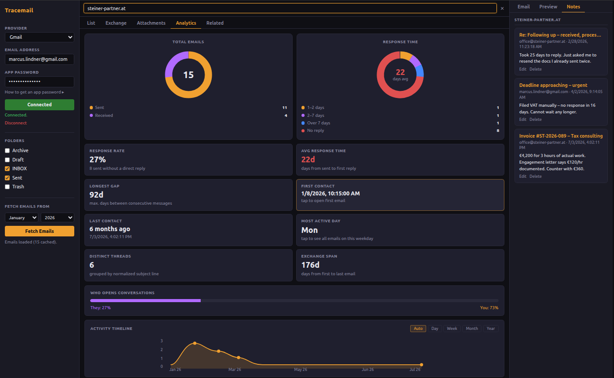

# Tracemail

> Local email investigation tool for Linux. No cloud. No AI. No subscriptions.

Tracemail is a local email investigation workspace for Linux.
Connect your inbox via IMAP, filter by a name or keyword, and
explore your correspondence in depth – as a readable chat-style
exchange, an attachment browser, a related email finder, and an
analytics dashboard.

Built for situations where you need to understand, reconstruct,
or present an email history: fee disputes, contract
disagreements, proof of correspondence, HR matters, legal
preparation, or any case where the details of what was said and
when are what matters.

[See it in action →](https://teokitten.github.io/tracemail/demo.html)



## What you can do with it

- **Reconstruct a conversation** – filter by a person or company
  and see the full exchange as a clean chat view, your messages
  on one side, theirs on the other, in chronological order
- **Find supporting evidence** – use the Related tab to surface
  emails that mention a keyword but were not part of the direct
  exchange, for example complaints sent to third parties about
  the same person or company
- **Analyze the relationship** – see response rates, who
  initiates conversations, how long replies take, gaps in
  communication, and when contact started and ended
- **Access attachments** – browse, preview, and download every
  attachment from a filtered exchange in one place, including
  PDFs, XLSX files, images, and documents
- **Annotate and print** – add notes to individual emails and
  print the full exchange as a clean document directly from
  the browser
- **Track communication patterns over time** – demonstrate that
  you consistently followed up, or that the other party was
  systematically slow to respond or went silent. The analytics
  timeline and gap metrics make this concrete.
- **Verify what was agreed in writing** – filter by a person or
  company and search for specific terms to locate the exact
  email where something was promised or confirmed
- **Separate signal from noise** – the Exchange view strips
  quoted threads and shows only the actual content of each
  message, making a high-volume correspondence readable in
  one scroll

## Privacy

- Runs entirely on your machine
- Connects directly to your IMAP server over SSL
- Credentials stored in localStorage only (never sent to any server)
- No data uploaded, logged, or shared
- No AI model, no cloud processing, no third-party services


## Features

- Five-tab workspace: List, Exchange, Attachments, Analytics,
  Related
- Chat-style exchange view with color-coded sent/received
  messages
- Inline attachment preview – PDF, XLSX, DOCX, and images
- Clickable analytics: response rate, reply time, gap analysis,
  activity timeline
- Related email discovery via IMAP body search
- Per-email notes included when printing
- Browser print to PDF – no export step
- Search history
- Read-only IMAP access
- Compatible with Yahoo, Gmail, Outlook, and any standard
  IMAP server

## Prerequisites

**Binary (recommended):**
Linux x86-64. No Python required. Download from Releases.

**From source:**
Python 3.11+, pip, git.

## How to run

### Option 1 – Download the binary

1. Go to the [Releases page](https://github.com/teokitten/tracemail/releases)
2. Download the latest `Tracemail-x86_64.AppImage` file
3. `chmod +x Tracemail-x86_64.AppImage && ./Tracemail-x86_64.AppImage`
4. Open http://localhost:5050 in your browser

If the AppImage fails to launch, see Compatibility below.

### Option 2 – Run from source

```bash
git clone https://github.com/teokitten/tracemail.git
cd tracemail
pip install flask PyPDF2 python-docx reportlab openpyxl
python app.py
```

Open your browser at `http://127.0.0.1:5050`.

**Note:** `openpyxl` is required for XLSX attachment preview.
If you see an error on first run, install it separately:
```bash
pip install openpyxl
```

### Option 3 – Build the binary yourself

For developers only. Produces a self-contained binary
equivalent to the one in GitHub Releases.

**Prerequisites:** Python 3.11 or later, PyInstaller

```bash
pip install pyinstaller
pyinstaller --onefile --name tracemail \
  --add-data "templates:templates" app.py
./dist/tracemail
```

## Compatibility

Tracemail's AppImage requires glibc 2.14 or newer (verified via
`objdump -T` against the bundled binary), which covers essentially
all glibc-based Linux distributions released since 2011.

**Tested on:**
- Ubuntu 22.04 (Linux Mint, glibc 2.35)

**Should work, not tested:**
- Debian 8+
- Fedora, RHEL/Rocky/Alma 7+
- openSUSE Leap and Tumbleweed
- Arch, Manjaro
- Other Ubuntu-based distros (Pop!_OS, Zorin, elementary)

This list is based on glibc compatibility, not verification. If you run
it successfully on a distro not listed here, opening an issue to confirm
would help others.

**Not supported:**
- Alpine Linux and other musl-based distros (AppImage requires glibc)
- ARM architecture (binaries are x86_64 only)
- Windows, macOS

**If the binary won't run:** AppImage requires FUSE on most distros. If
you get a "fuse: device not found" error, install `fuse` (or `fuse3`)
via your package manager, or run with `--appimage-extract-and-run`.

**Fallback for anything not covered above:** run from source (see
Option 2 above). This works on any system with Python 3.11+,
regardless of glibc, libc variant, or architecture.

## App password setup

Yahoo, Gmail, and Outlook require an app-specific password
when IMAP is enabled with two-step verification. Your regular
account password will not work.

### Yahoo Mail

1. Go to Account Security in your Yahoo account settings
2. Enable two-step verification if not already active
3. Under Generate app password, select Other app and copy
   the result

Guide: https://help.yahoo.com/kb/generate-third-party-passwords-sln15241.html

### Gmail

1. Enable two-step verification on your Google account
2. Go to Google Account → Security → App Passwords
3. Select Mail and your device, then copy the result

You must also enable IMAP before connecting: Gmail → Settings
→ See all settings → Forwarding and POP/IMAP → Enable IMAP
→ Save Changes.

Guide: https://support.google.com/accounts/answer/185833

### Outlook (personal accounts)

1. Go to Microsoft Account → Security → Advanced security
   options
2. Under App Passwords, select Create a new app password
3. Copy the result

Note: IMAP may be disabled on work or school accounts by your
organization. Tracemail cannot connect if IMAP has been
blocked at the admin level.

Guide: https://support.microsoft.com/en-us/account-billing/using-app-passwords-with-apps-that-don-t-support-two-step-verification-5896ed9b-4263-e681-128a-a6f2979a7944

## How to use

Type a name, company, or keyword in the filter bar to load
all tabs. Each tab shows a different view of the same filtered
correspondence:

**List** – chronological email list. Click any row to read
the full email on the right panel.

**Exchange** – chat-style conversation view. Your sent messages
appear on the right in amber, received messages on the left in
purple. Attachments are accessible inline. Add notes to
individual messages. Print the full exchange using the button
at the bottom right.

**Attachments** – all attachments found in the filtered
exchange, grouped by type. Preview PDFs natively, view XLSX
files as tables, and see images inline. Download any file
individually.

**Analytics** – response rate, average response time, longest
gap, first and last contact, most active weekday, who opens
conversations, and a reply time breakdown. All metrics are
clickable. Includes an activity timeline with adjustable
granulation.

**Related** – emails that mention the filter keyword in the
body but are not part of the direct exchange.

## Supported attachment previews

| Format | Preview |
|--------|---------|
| PDF | Native browser render |
| XLSX | Table view |
| DOCX | Extracted text |
| Images (JPG, PNG, GIF, WebP, etc.) | Inline image |
| ZIP, XOPP, other | Download only |

## Resource usage

No GPU, no background processes. Fetches email headers in a
single IMAP batch call. Full message bodies and attachments
load on demand. Runs on any Linux hardware that can run a
browser.

## Updates

No auto-update. Check
[GitHub Releases](https://github.com/teokitten/tracemail/releases)
for new versions. Download the new binary and replace the
old one.

## Uninstall

Delete the binary:

```bash
rm Tracemail-x86_64.AppImage
```

To remove all cached data, clear site data for
`http://127.0.0.1:5050` in your browser settings. This removes
stored credentials, cached emails, notes, and search history.

## Known limitations

- Linux only. See Compatibility above for distro and
  architecture details.
- Yahoo IMAP limits date-range searches to approximately
  1,000 emails regardless of the range selected
- Full message bodies and attachments load on demand –
  opening an email for the first time requires a server
  round trip
- XOPP and ZIP files cannot be previewed; download to open
  locally
